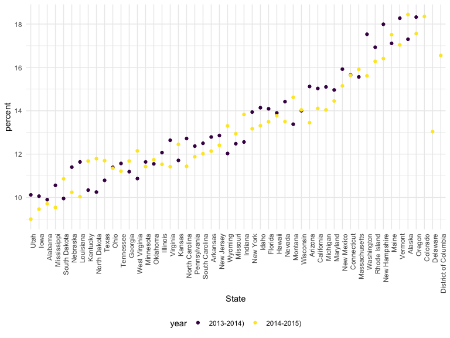
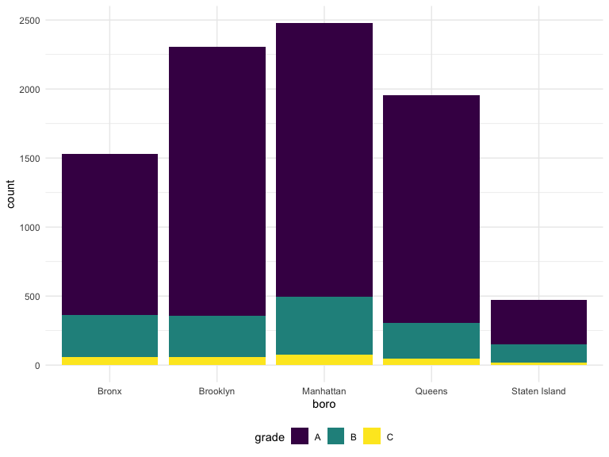
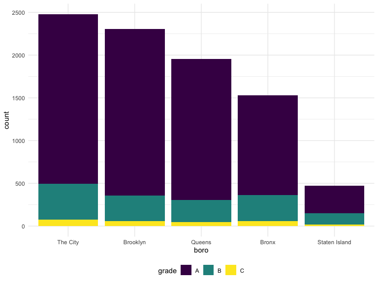

Strings And Factors
================

## String and Regex

``` r
# case sensitive
string_vec = c("my", "name", "is", "jeff")

str_detect(string_vec, "m")
```

    ## [1]  TRUE  TRUE FALSE FALSE

``` r
str_replace(string_vec, "e", "This is an uppercase E")
```

    ## [1] "my"                        "namThis is an uppercase E"
    ## [3] "is"                        "jThis is an uppercase Eff"

``` r
# replace with empty space
str_replace(string_vec, "e", "")
```

    ## [1] "my"  "nam" "is"  "jff"

``` r
string_vec = c(
  "i think we all rule for participating",
  "i think i have been caught",
  "i think this will be quite fun actually",
  "it will be fun, i think"
)

str_detect(string_vec, "i think")
```

    ## [1] TRUE TRUE TRUE TRUE

``` r
str_detect(string_vec, "^i think")
```

    ## [1]  TRUE  TRUE  TRUE FALSE

``` r
str_detect(string_vec, "i think$")
```

    ## [1] FALSE FALSE FALSE  TRUE

``` r
string_vec = c(
  "Y'all remember Pres. HW Bush?",
  "I saw a green bush",
  "BBQ and Bushwalking at Molonglo Gorge",
  "BUSH -- LIVE IN CONCERT!!"
  )

str_detect(string_vec, "bush")
```

    ## [1] FALSE  TRUE FALSE FALSE

``` r
str_detect(string_vec,"[Bb]ush")
```

    ## [1]  TRUE  TRUE  TRUE FALSE

``` r
string_vec = c(
  '7th inning stretch',
  '1st half soon to begin. Texas won the toss.',
  'she is 5 feet 4 inches tall',
  '3AM - cant sleep :('
  )

# a number followed by a lowercase letter/an uppercase letter
str_detect(string_vec, "^[0-9][a-zA-Z]")
```

    ## [1]  TRUE  TRUE FALSE  TRUE

The character `.` matches anything.

``` r
string_vec = c(
  'Its 7:11 in the evening',
  'want to go to 7-11?',
  'my flight is AA711',
  'NetBios: scanning ip 203.167.114.66'
  )

str_detect(string_vec, "7.11")
```

    ## [1]  TRUE  TRUE FALSE  TRUE

Looking for bracket…

``` r
string_vec = c(
  'The CI is [2, 5]',
  ':-]',
  ':-[',
  'I found the answer on pages [6-7]'
  )
# double slash
str_detect(string_vec, "\\[")
```

    ## [1]  TRUE FALSE  TRUE  TRUE

# Why Fators are weird

``` r
vec_sex = factor(c("male", "male", "female", "female"))
vec_sex
```

    ## [1] male   male   female female
    ## Levels: female male

``` r
as.numeric(vec_sex)
```

    ## [1] 2 2 1 1

``` r
vec_sex = fct_relevel(vec_sex, "male")
vec_sex
```

    ## [1] male   male   female female
    ## Levels: male female

``` r
as.numeric(vec_sex)
```

    ## [1] 1 1 2 2

## NSDUH

``` r
nsduh_url = "http://samhda.s3-us-gov-west-1.amazonaws.com/s3fs-public/field-uploads/2k15StateFiles/NSDUHsaeShortTermCHG2015.htm"

table_marj = 
  read_html(nsduh_url) %>% 
  html_table() %>% 
  first() %>%
  slice(-1)
```

let’s clean this up!

``` r
marj_df <-
  table_marj %>%
  # select all columns except those with P Value
  select(-contains("P Value")) %>%
  # select all columns except "State"
  pivot_longer(
    -State,
    names_to = "age_year",
    values_to = "percent") %>%
  separate(age_year, into = c("age", "year"), "\\(") %>%
  # or separate(age_year, into = c("age", "year"), -11)
  mutate(
    year = str_replace(year, "\\(", ""),
    precent = str_replace(percent, "[a-c]$", ""),
    percent = as.numeric(percent)
  ) %>%
  filter(!(State %in% c("Total U.S.", "Northeast", "Midwest", "South", "West")))
```

Do dataframe stuff

``` r
marj_df %>%
  filter(age == "12-17") %>%
  mutate(
    State = fct_reorder(State, percent)
  ) %>%
  ggplot(aes(x = State, y = percent, color = year)) + 
    geom_point() + 
    # rotate text
    theme(axis.text.x = element_text(angle = 90, hjust = 1))
```



## Resturants Inspections

``` r
data("rest_inspec")
```

``` r
rest_inspec %>% 
  group_by(boro, grade) %>% 
  summarize(n = n()) %>% 
  pivot_wider(names_from = grade, values_from = n)
```

    ## `summarise()` has grouped output by 'boro'. You can override using the `.groups` argument.

    ## # A tibble: 6 × 8
    ## # Groups:   boro [6]
    ##   boro              A     B     C `Not Yet Graded`     P     Z  `NA`
    ##   <chr>         <int> <int> <int>            <int> <int> <int> <int>
    ## 1 BRONX         13688  2801   701              200   163   351 16833
    ## 2 BROOKLYN      37449  6651  1684              702   416   977 51930
    ## 3 MANHATTAN     61608 10532  2689              765   508  1237 80615
    ## 4 Missing           4    NA    NA               NA    NA    NA    13
    ## 5 QUEENS        35952  6492  1593              604   331   913 45816
    ## 6 STATEN ISLAND  5215   933   207               85    47   149  6730

``` r
rest_inspec <-
  rest_inspec %>%
  filter(
    str_detect(grade, "[ABC]"),
    boro != "Missing"
  ) %>%
  mutate(boro = str_to_title(boro))
rest_inspec
```

    ## # A tibble: 188,195 × 18
    ##    action        boro   building  camis critical_flag cuisine_descrip… dba      
    ##    <chr>         <chr>  <chr>     <int> <chr>         <chr>            <chr>    
    ##  1 Violations w… Manha… 1271     5.00e7 Critical      American         THE HARO…
    ##  2 Violations w… Manha… 37       4.12e7 Not Critical  Korean           SHILLA K…
    ##  3 Violations w… Manha… 53       4.04e7 Not Critical  Korean           HAN BAT …
    ##  4 Violations w… Manha… 287      4.16e7 Not Critical  American         BRGR     
    ##  5 Violations w… Manha… 800      4.11e7 Not Critical  Pizza            WALDY'S …
    ##  6 Violations w… Manha… 121      5.00e7 Not Critical  Café/Coffee/Tea LUNA     
    ##  7 Violations w… Manha… 124      4.10e7 Critical      American         JOHNY'S …
    ##  8 Violations w… Manha… 138      4.11e7 Critical      American         AROME CA…
    ##  9 Violations w… Manha… 839      5.00e7 Not Critical  American         L'AMICO/…
    ## 10 Violations w… Manha… 35       4.13e7 Critical      Korean           MADANGSUI
    ## # … with 188,185 more rows, and 11 more variables: inspection_date <dttm>,
    ## #   inspection_type <chr>, phone <chr>, record_date <dttm>, score <int>,
    ## #   street <chr>, violation_code <chr>, violation_description <chr>,
    ## #   zipcode <int>, grade <chr>, grade_date <dttm>

``` r
rest_inspec %>% 
  filter(str_detect(dba, "[Pp][Ii][Zz][Zz][Aa]")) %>% 
  group_by(boro, grade) %>% 
  summarize(n = n()) %>% 
  pivot_wider(names_from = grade, values_from = n)
```

    ## `summarise()` has grouped output by 'boro'. You can override using the `.groups` argument.

    ## # A tibble: 5 × 4
    ## # Groups:   boro [5]
    ##   boro              A     B     C
    ##   <chr>         <int> <int> <int>
    ## 1 Bronx          1170   305    56
    ## 2 Brooklyn       1948   296    61
    ## 3 Manhattan      1983   420    76
    ## 4 Queens         1647   259    48
    ## 5 Staten Island   323   127    21

``` r
rest_inspec %>% 
  filter(str_detect(dba, "[Pp][Ii][Zz][Zz][Aa]")) %>%
  ggplot(aes(x = boro, fill = grade)) + 
  geom_bar() 
```



What about changing a label

``` r
rest_inspec %>% 
  filter(str_detect(dba, "[Pp][Ii][Zz][Zz][Aa]")) %>%
  mutate(
    # arrange by order
    boro = fct_infreq(boro),
    # rename manhattan
    boro = fct_recode(boro, "The City" = "Manhattan")
    # wrong: boro = str_replace(boro, "Manhattan", "The City"), does not preserve order
  ) %>%
  ggplot(aes(x = boro, fill = grade)) + 
  geom_bar() 
```


